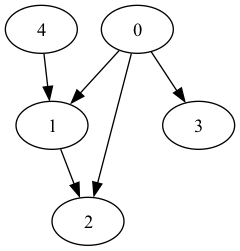
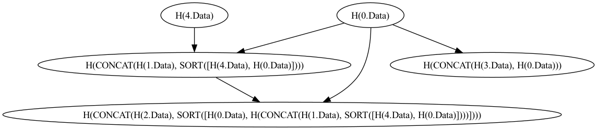
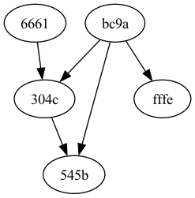

# Hash DAG in Go

`hash-dag-go` is a library for converting a vanilla Directed Acyclic Graphs (DAG) to a thing which I'm calling a hash DAG (which is not to be confused with the [IPFS Merkle DAG](https://docs.ipfs.tech/concepts/merkle-dag/)).

<p float="left">
	<table>
		<tr>
			<td width="33%"></td>
			<td width="33%"></td>
			<td width="34%"></td>
		</tr>
        <tr>
			<td>input vanilla DAG</td>
			<td>-> apply hashing function</td>
			<td>-> output hash DAG</td>
		</tr>
	</table>
</p>

## Usage

```go
package main

import (
	"flag"
	"github.com/laser/hash-dag-go"
	"math/rand"

	gvz "github.com/laser/random-dag-generator-go/render/graphviz"

	"github.com/laser/hash-dag-go/vanilla"
)

var (
	nodeQty      = flag.Int("node-qty", 1+rand.Intn(20), "number of nodes in the DAG")
	maxOutdegree = flag.Int("max-outdegree", 1+rand.Intn(4), "max number of edges directed out of a node")
	edgeFactor   = flag.Float64("edge-factor", 1.0-rand.Float64(), "probability of adding a new edge between nodes during the graph generation")
	outputPath   = flag.String("output-path", "/tmp/hash-dag.png", "path to which the generated DAG-PNG will be saved")
)

func main() {
	flag.Parse()

	input := vanilla.Graph{
		Nodes: []vanilla.Node{
			{Id: vanilla.NodeId("1"), Data: []byte("abc")},
			{Id: vanilla.NodeId("2"), Data: []byte("def")},
			{Id: vanilla.NodeId("3"), Data: []byte("ghi")},
		},
		Edges: []vanilla.Edge{
			{SourceNodeId: vanilla.NodeId("1"), TargetNodeId: vanilla.NodeId("2")},
			{SourceNodeId: vanilla.NodeId("1"), TargetNodeId: vanilla.NodeId("3")},
			{SourceNodeId: vanilla.NodeId("3"), TargetNodeId: vanilla.NodeId("2")},
		},
	}

	// builds a new hash DAG from the input DAG using a hash of the node data
	// plus its parents hashes as the node id
	mdag := hashdag.From(input)

	converted := gvz.From(mdag)

	gvz.RenderTo(converted, *outputPath)
}
```
